# キーワードで振り返る2015年のIoTトピックス

- 目次
    - 02-02 Raspberry Pi 2
    - 04-29 Windows10 IoT Core
    - 07-07 ESP8266
    - 07-27 myThings
    - 09-30 SORACOM
    - 10-09 AWS Iot
    - 11-25 Raspberry Pi Zero
    - 12-24 さくらのIoT Platform(仮称)
    - MQTT
    - NodeRed
    - ブロックチェーン
    - 2016年の期待

# Raspberry Pi 2
- 2月2日 発表
    - 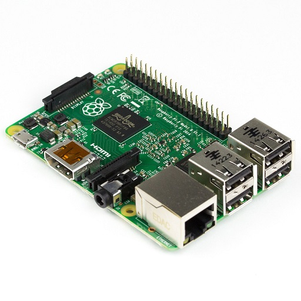
    - [Raspberry Pi 2 on sale now at $35 - Raspberry Pi](https://www.raspberrypi.org/blog/raspberry-pi-2-on-sale/ "Raspberry Pi 2 on sale now at $35 - Raspberry Pi")
- 当時の最新機種Raspberry Pi Model B+と比較して
    - お値段
        - そのまま $35
    - CPU
        - シングルコア700MHz → クアッドコア900MHz
    - メモリ
        - 512MB → 1GB
- Raspberry Pi 2用のWindows10が無償で今後提供される、という発表

# Windows10 IoT Core
- 4月29日 マイクロソフトの技術カンファレンス「Build 2015」で発表
- 8月10日 正式版の無償ダウンロード開始
- Microsoft製の組込みOS
    - Windows10のようなデスクトップ環境無し。
    - GUI有りのユニバーサルWindowsアプリが動作。
- 対応するボード
    - Raspberry Pi 2, MinnowBoard Max, DragonBoard410c
- 開発するには
    - Windows 10のPCでWindows10 Iot CoreのディスクイメージをSDカードに書き込む
    - Visual Studio 2015が必要
- 個人的には、環境構築や開発が面倒

# ESP8266
- ESP8266を使ったWiFiモジュールの一つ、「ESP-WROOM-02」が7月に発売開始
    - 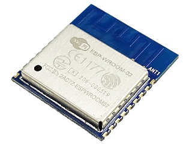
- Arduino用のWiFiモジュールとしても使用でき、単体でWiFi搭載のArduinoマイコンとしても使用できる
    - Arduino IDEで開発できる
- [Ｗｉ－Ｆｉモジュール　ＥＳＰ－ＷＲＯＯＭ－０２　ＤＩＰ化キット:秋月電子通商](http://akizukidenshi.com/catalog/g/gK-09758/ "Ｗｉ－Ｆｉモジュール　ＥＳＰ－ＷＲＯＯＭ－０２　ＤＩＰ化キット:秋月電子通商") 650円(税込)
- 参考
    - [Arduinoマイコンとしても使える小型WifiモジュールESP-WROOM-02を使ってみる(準備編) | Device Plus - デバプラ](http://deviceplus.jp/hobby/entry0032/ "Arduinoマイコンとしても使える小型WifiモジュールESP-WROOM-02を使ってみる(準備編) | Device Plus - デバプラ")
    - [技適済み格安高性能Wi-FiモジュールESP8266をArduinoIDEを使ってIoT開発する為の環境準備を10分でやる方法 - Qiita](http://qiita.com/azusa9/items/264165005aefaa3e8d7d "技適済み格安高性能Wi-FiモジュールESP8266をArduinoIDEを使ってIoT開発する為の環境準備を10分でやる方法 - Qiita")
    - [Information of ESP8266 随時追加 | macsbug](https://macsbug.wordpress.com/2015/06/21/information-of-esp8266-%E9%9A%8F%E6%99%82%E8%BF%BD%E5%8A%A0/ "Information of ESP8266 随時追加 | macsbug")

# myThings
- 7月27日 提供開始
- ヤフーが提供する、IoTプラットフォームおよびスマホアプリ
- 自作のデバイスやガジェット、Webサービス(myThingsではチャンネルと呼ぶ)を組み合わせる
- Webサービス同士を連携させるWebサービス「IFTTT」の日本版とよく言われている
- チャンネルの例
    - 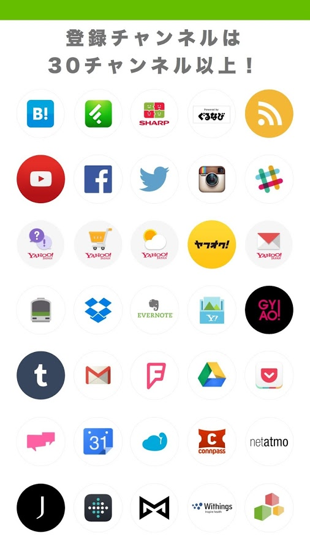
    - 自作のデバイス
        - IDCFクラウド(Yahooグループのクラウド)の利用が必須
    - ガジェット
        - [BOCCO - 家族をつなぐコミュニケーションロボット - DMM.make ROBOTS](http://robots.dmm.com/robot/bocco "BOCCO - 家族をつなぐコミュニケーションロボット - DMM.make ROBOTS")
            - 
            - 鼻がボリューム、お腹にメッセージ再生・録音ボタン、ドアの開閉センサーと連携
            - 29,000円
        - [ともだち家電：シャープ](http://www.sharp.co.jp/tomodachi/ "ともだち家電：シャープ")
            - 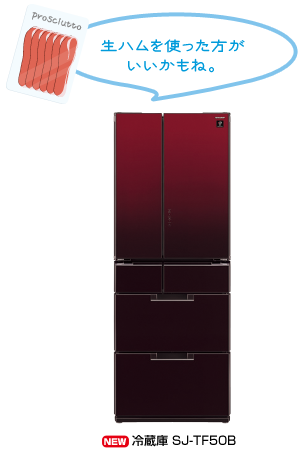
            - 音声認識して食品の追加や消費を記録。食品名をつぶやくとメニューをおすすめ。
            - 280,000円
        - [iRemocon](http://i-remocon.com/ "iRemoconトップページ") ネットワーク接続型の学習リモコン
            - 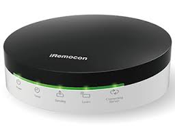
            - WiFi, 温度湿度照度センサー、音声認識、スマホアプリから操作
            - 20,741円
        - [Hackey - Webサービスをコントロールできるキースイッチ](http://hackey.cerevo.com/ja/ "Hackey - Webサービスをコントロールできるキースイッチ")
            - 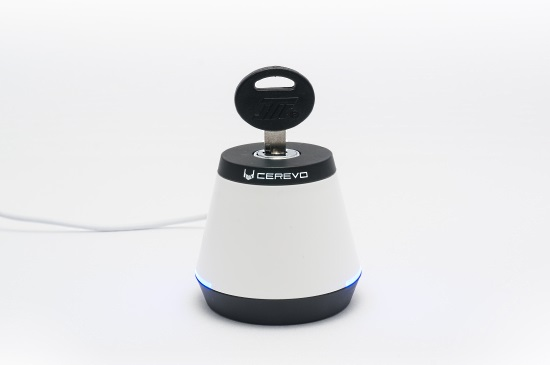
            - 鍵をひねるとWiFi経由でPOST。通知があると本体のLEDが点灯。
            - 9,980円
        - Withings(体重計、スマートウォッチ)
        - Fitbit(活動量計)
        - JawboneUP(活動量計)
    - Webサービス
        - Yahoo!天気・災害
        - ヤフオク！
        - Twitter
        - などなど

# SORACOM
- 9月30日発表
- 元AWSのエバンジェリスト玉川憲さんが2015年3月にAWSを退職して設立したスタートアップ
- IoTの課題である「通信」と「セキュリティ」の問題を解決
- MVNO事業者が持つハードウェア(パケット交換、回線管理、帯域制御、顧客管理、課金)を、AWS上でソフトウェアで実装
    - NTTドコモの基地局を使用
    - 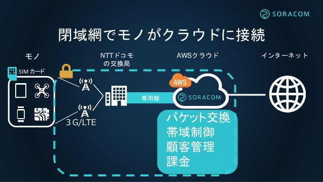
- SORACOM AirとSORACOM Beamの２つのサービス
- SORACOMカンファレンスが2016年1月27日開催
    - [SORACOM Conference 2016 “Connected.”｜ソラコム｜SORACOM, INC](https://connected2016.soracom.jp/ "SORACOM Conference 2016 “Connected.”｜ソラコム｜SORACOM, INC")
- docomo-LTE対応USBモデム、L-02Cがこの頃から人気に。ヤフオクで値上がり(1000円→3000円)

## SORACOM Air
- IoT向けのデータ通信SIM "Air SIM" を提供するモバイルデータ通信サービス
    - LTE, 3Gエリアに対応
    - 基本料金は1日1枚10円、データ通信量は1MBあたり0.2円からの従量課金
    - ユーザーコンソール, API, SDKから多数のSIMを一括操作(AWS like)
    - 独自のDNSサーバーを指定可能(カスタムDNS)
        - 未認証ユーザは必ず認証ポータルに誘導
    - Air SIMの情報をHTTP経由で取得、更新(メタデータサービス)
        - デバイスにAPIのアクセストークンを保存する必要がない

### 料金
- データ通信のみのSIM 888円(税込)
    - [Amazon.co.jp： SORACOM Air SIMカード（データ通信のみ） (ナノ): 家電・カメラ](http://www.amazon.co.jp/SORACOM-Air-SIM%E3%82%AB%E3%83%BC%E3%83%89%EF%BC%88%E3%83%87%E3%83%BC%E3%82%BF%E9%80%9A%E4%BF%A1%E3%81%AE%E3%81%BF%EF%BC%89-%E3%83%8A%E3%83%8E/dp/B015FFCZ02 "Amazon.co.jp： SORACOM Air SIMカード（データ通信のみ） (ナノ): 家電・カメラ")
- 基本料金(税別)
    - 1日10円(データ通信のみ)
- 従量課金(税別)
    - 通常時間帯（日本時間 06:00-26:00）
        - 最遅…上り0.2 円 / MB、下り0.6 円 / MB(上り下り共に32kbps)
        - 最速…上り0.3 円 / MB、下り1.0 円 / MB(上り下り共に2Mbps)
    - 深夜時間帯（日本時間 02:00-06:00）
        - 最遅…上り0.2 円 / MB、下り0.2 円 / MB(上り下り共に32kbps)
        - 最速…上り0.2 円 / MB、下り0.2 円 / MB(上り下り共に2Mbps)

### 料金比較
- 初期費用
    - SORACOM 888円(税込)
    - 0SIM 620円(税込、デジモノステーション2016/02)
    - IIJmio 3000円(税抜)
    - FREETEL  3000円(税抜)
- 1ヶ月間500MB下り
    - SORACOM 400円 (`10yen/day x 30days + 0.2yen/MB x 500MB`)
    - 0SIM 0円 (基本料金0円、500MBまで0円)
    - IIJmio 900円(3GBまで)
    - FREETEL 499円 (1GBまで、100MBまでなら299円)
- 1ヶ月間1GB下り
    - SORACOM 500円 (`10yen/day x 30days + 0.2yen/MB x 1000MB`)
    - 0SIM 500円 (`100yen/100MB x 500MB`)
    - IIJmio 900円(3GBまで)
    - FREETEL 499円 (1GBまで、3GBまでなら900円)

## SORACOM Beam
- データ転送支援サービス
    - 暗号化
        - 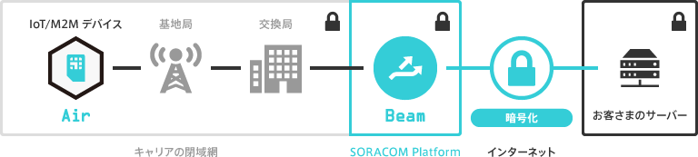
        - クライアント証明書をBeamで管理
    - ヘッダ付与
        - SIMのIDを追加
    - プロトコル変換
        - HTTP, TCP, UDP, MQTT -> HTTPS, MQTTS, TCPS
    - ルーティング
        - コンソールなどで接続先を変更
- 料金
    - 基本料金
        - 無料
    - 従量課金
        - 1リクエストあたり0.0009円(税別)

# AWS IoT
- 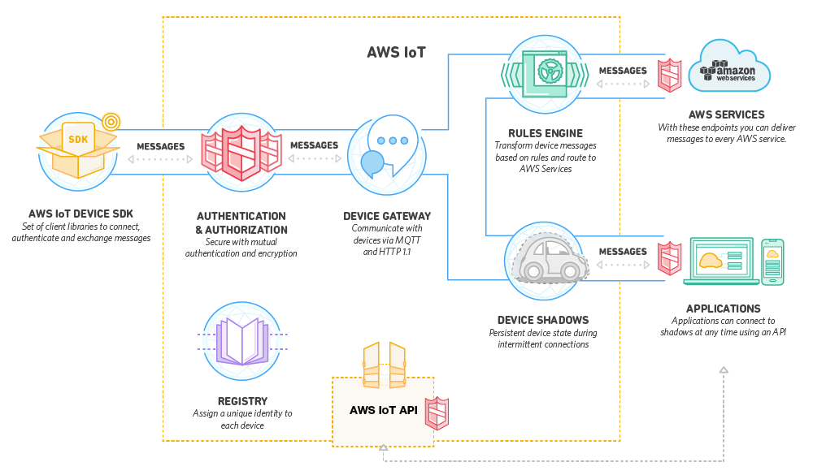
- AWSのIoTプラットフォーム
- 10月9日の「AWS re:Invent 2015」で発表
- 料金
    - 100万通のメッセージあたり$8(東京リージョン)

## 構成要素
- AWS IoT デバイス SDK
    - C, JavaScript, Arduino
- デバイスゲートウェイ
    - MQTT, HTTP
    - 自動的にスケール
- 認証と認可
    - AWSの認証メソッド(SigV4)およびX.509証明書ベースの認証
- レジストリ
    - デバイス管理
- デバイスシャドウ
    - オフライン時の仮想デバイス
- ルールエンジン
    - データをルールに従って転送
    - SQLに似た構文
    - 転送先はS3, DynamoDB, Kinesis, SNS, Lambdaなど

# Raspberry Pi Zero
- 11月25日発表
- 特徴
    - 安い(5ドル)
    - 小さい(薄い)
    - LANポート無し
        - USBにWiFiドングルかSIMドングルを挿して通信
        - セットアップ時にはUSBハブが無いとつらい
    - カメラモジュール使えない
    - GPIOピン未実装
        - 必要な分だけハンダ付け
        - USBシリアル変換ケーブル
    - micro USBポートが2つあるが1つは電源用。

## 買ってみた
- [Raspberry Pi Zero - Pimoroni](https://shop.pimoroni.com/products/raspberry-pi-zero)で12月14日に発注
    - Pi Zero + Adaptors + Pibow Zero Case
    - 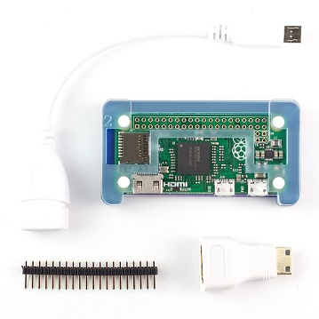
    - £9.58 + Shipping £4.00 = £13.58(￥2602)
- 12月27日到着

## セットアップ
- USBハブを持っている時
    - USBハブを挿して、キーボード用のUSBドングルと、WiFiまたはSIMドングルを接続
- USB-Ethernetアダプタを持っている時
    - USB-Ethernetアダプタを刺したRaspberry Pi ZeroをLANに接続
    - MacもしくはiTunes(Bonjour)インストール済みWindowsから`ssh -l pi raspberrypi.local`
- 別のRaspberry Piを持っている時
    - 別のRaspberry PiでセットアップしたmicroSDカードを差し替え

## 比較
||Raspberry Pi 2 Model B|Raspberry Pi 1 Model A+|Raspberry Pi Zero|
|:--|:--|:--|:--|
|Price|$35|$20|$5|
|Audio|Multi-Channel HD Audio over HDMI, Stereo from 3.5 mm jack|Multi-Channel HD Audio over HDMI, Stereo from 3.5 mm jack|Multi-Channel HD Audio over HDMI|
|CPU|900 MHz Low Power ARMv7 Quad Core Processor|700 MHz Low Power ARM1176JZ-F Applications Processor|1 GHz Low Power ARM1176JZ-F Applications Processor|
|Dimensions|85mm x 56mm x 21mm|65mm x 56mm x 12mm|65mm x 30mm x 5mm|
|Ethernet|1x 10/100mb Ethernet RJ45 Jack|None|None|
|GPIO|40|40|40 pin (unpopulated)|
|Other Connectivity|1x CSI-2 for Raspberry Pi camera modules, 1x DSI for Raspberry Pi displays|1x CSI-2 for Raspberry Pi camera modules, 1x DSI for Raspberry Pi displays|None|
|Power|5V micro USB input. 800mA rating|5V micro USB input. 200mA rating|5V micro USB input. 160mA rating|
|RAM|1GB SDRAM @ 450 MHz|256 MB SDRAM @ 400 MHz|512 MB SDRAM @ 400 MHz|
|USB 2.0|4x USB Ports|1x USB Port|1x Micro USB Port|
|Video Connections|HDMI, Composite RCA (shared with audio jack)|HDMI, Composite RCA (shared with audio jack)|HDMI|

# さくらのIoT Platform
- 12月24日発表、2016年2月にテスター募集、春にβテスト
- 提供するもの
    - 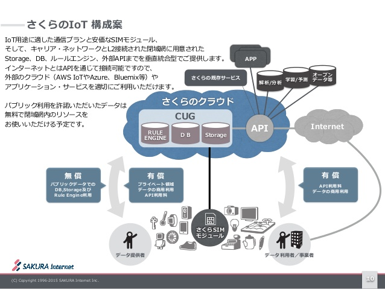
    - SIMカードおよび通信プラン
    - SIMモジュール
        - さくらのIoT閉域網にのみデータの送受信
    - プロトタイプボード
        - Cerevo社のBlueNinja、GPSを搭載
    - クラウドサービス(DB、ストレージ、ルールエンジン、API)

## BlueNinja
- 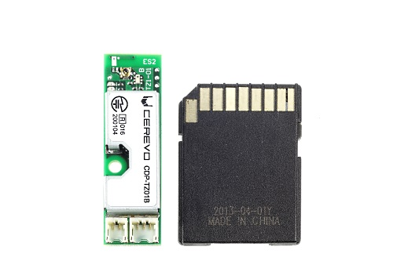
- BLE対応
- 速度・角度・地磁気・気圧の数値を取得
- インターフェースは	GPIO / USB(device) / SPI / I2C / UART
- GCCベースの開発環境、現在はC言語のみ
- 試作から量産まで幅広くカバーしたIoT開発モジュール「BlueNinja」発表 | Cerevoからのお知らせ https://info-blog.cerevo.com/2015/07/28/1219/

## 参考
- [さくらのIoT Platform](http://www.slideshare.net/ogasahara/sakura-iot-platform "http://bit.ly/1QJJe4A")
    - [ASCII.jp：さくらインターネットがIoT参入を電撃公表！](http://ascii.jp/elem/000/001/097/1097584/ "ASCII.jp：さくらインターネットがIoT参入を電撃公表！")
    - [ネットワーク屋とハードウエア屋の距離を縮める？：聖夜にお披露目された「さくらのIoT Platform」、2016年春めどにβテスト予定 - ＠IT](http://www.atmarkit.co.jp/ait/articles/1512/25/news166.html "ネットワーク屋とハードウエア屋の距離を縮める？：聖夜にお披露目された「さくらのIoT Platform」、2016年春めどにβテスト予定 - ＠IT")
    - [「役員会通ってたら書ける」改め「さくらインターネットでやりたいIoT」 — Medium](https://medium.com/@ogasahara/%E5%BD%B9%E5%93%A1%E4%BC%9A%E9%80%9A%E3%81%A3%E3%81%A6%E3%81%9F%E3%82%89%E6%9B%B8%E3%81%91%E3%82%8B-%E6%94%B9%E3%82%81-%E3%81%95%E3%81%8F%E3%82%89%E3%81%A7%E3%82%84%E3%82%8A%E3%81%9F%E3%81%84iot-124de44ce8f#.gbast8piy "「役員会通ってたら書ける」改め「さくらインターネットでやりたいIoT」 — Medium")

# MQTT
- IoTやM2M(Machine-to-Machine)向けの軽量プロトコル
    - ヘッダーは最小2バイト(GETリクエストヘッダの最小は14バイト)
- Pub/Subモデルのシステム
    - Publisher
        - トピックに関してBroker宛にメッセージ発行
    - Broker
        - メッセージを仲介するサーバ
    - Subscriber
        - トピックに関してBrokerからメッセージ受信
- トピック
    - メッセージは固有のトピックを持つ
    - `/user_name/room/01/temperature`のような/区切りの階層構造
    - Subscriberはトピックを指定して受信できる
        - `/user_name/room/01/#` 前方一致
        - `/user_name/room/+/temperature` 部分一致
- QoS
    - Quality of Service. メッセージ配信の品質
    - QoS0
        - 最高1回。確実に届く保証はない。再送なし
    - QoS1
        - 最低1回。必ず届けるが、重複の可能性あり
    - QoS2
        - 正確に1回。必ず届けて重複なし
- Will
    - PublisherがBrokerに接続したときにWill(遺言)としてメッセージを設定。
    - PubrisherとBrokerが意図せず切断された時に、BrokerがSubscriberにそのメッセージを送信する
        - Publisherが「死んだ」ことがわかる
- Retain
    - トピックの最後のメッセージをBrokerが保持して、新しいSubscriberにそのメッセージを渡す
- セキュリティ
    - TLS(証明書)で暗号化
- 日本でMQTTといえば時雨堂の[sango](https://sango.shiguredo.jp/ "MQTT as a Service sango")(MQTT as a Service、Erlang製)が有名らしい

## 参考文献
- [公式ドキュメント](http://mqtt.org/ "MQTT")
- [sango/MQTT](https://sango.shiguredo.jp/mqtt "MQTT as a Service sango")
- [MQTTについてのまとめ — そこはかとなく書くよん。](http://tdoc.info/blog/2014/01/27/mqtt.html "MQTTについてのまとめ — そこはかとなく書くよん。")
    - [MQTTのMQはMessage Queueではありません — そこはかとなく書くよん。](http://tdoc.info/blog/2015/02/09/mqtt_is_not_queue.html "MQTTのMQはMessage Queueではありません — そこはかとなく書くよん。")

# Node-RED
- ブラウザ上で動作するフローエディタ
    - 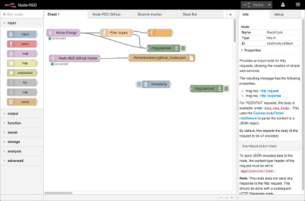
    - ノード(ハードウェアデバイス、API、Webサービス)を繋いでシステムを構築
- IBM Emerging Technologyが作成したOSS。2014年3月発表
- Node.jsで動作
- IBM Bluemix(IBMのクラウドサービス)を使うと、簡単にNode-REDを使い始められる
- [Node-RED](http://nodered.org/ "Node-RED")

# ブロックチェーン
- IoTにおけるデータの保存先にブロックチェーンが注目されている
    - [さくらインターネットがブロックチェーン環境をベータ提供、石狩・東京で分散 | TechCrunch Japan](http://jp.techcrunch.com/2015/12/16/sakura-internet-and-techbureau-start-blockchain-service-in-the-cloud/?utm_source=dlvr.it&amp;utm_medium=twitter "さくらインターネットがブロックチェーン環境をベータ提供、石狩・東京で分散 | TechCrunch Japan")
>IoTではデバイスの数が1桁とか2桁といったレベルで増えていくし、センサーネットワークであれば小さなデータが一斉に吸い上げられることになる。その保存先としてブロックチェーン技術は注目されていて、例えば2015年1月にIBMが発表した論文は話題になった。中央集約的なサーバーやサーバー群は、IoT時代に破綻するだろうという考察だ。
- ビットコインのブロックチェーン＝ビットコインの取引履歴
- ブロック
    - 取引情報(トランザクション、AさんがBさんに3ビットコイン送った)、前のブロックのハッシュが含まれる
    - 前のブロックのハッシュを含むことでブロックがチェーン状に繋がり、ブロックが改ざんされにくくなる
- 世界初のブロックチェーン上場企業が誕生
    - [世界初ブロックチェーン上場企業誕生　英コインシリウム | ZUU online](https://zuuonline.com/archives/92770 "世界初ブロックチェーン上場企業誕生　英コインシリウム | ZUU online")

## 参考
- [仮想通貨「Bitcoin」を完璧に理解するために知っておきたいことまとめ - GIGAZINE](http://gigazine.net/news/20140307-what-is-bitcoin-2nd/ "仮想通貨「Bitcoin」を完璧に理解するために知っておきたいことまとめ - GIGAZINE")
- [Cryptocurrency - わかりやすいブロックチェーン(blockchain)とは何か? の説明 - Qiita](http://qiita.com/hshimo/items/1881fba8957c2a6e17ca "Cryptocurrency - わかりやすいブロックチェーン(blockchain)とは何か? の説明 - Qiita")
- [Bitcoin - ビットコインのブロックチェーンの技術的な説明 まとめ - Qiita](http://qiita.com/hshimo/items/bd849363a871966a923f "Bitcoin - ビットコインのブロックチェーンの技術的な説明 まとめ - Qiita")
- [さくらインターネットとテックビューロ、ブロックチェーンの実証実験環境「mijinクラウドチェーンβ」を金融機関やITエンジニア向けに無料提供～本日より申込受付を開始し、2016年1月から順次提供～](http://www.sakura.ad.jp/press/2015/1216_mijin_cloud_chain/ "さくらインターネットとテックビューロ、ブロックチェーンの実証実験環境「mijinクラウドチェーンβ」を金融機関やITエンジニア向けに無料提供～本日より申込受付を開始し、2016年1月から順次提供～")
    - [mijinについて | mijin](http://mijin.io/about-mijin "mijinについて | mijin")

# 2016年の期待

## 格安のモバイル通信(3G, LTE)モジュール
- SORACOMの登場で、SIMは安く入手できるが、SIMのモジュールが高い
    - [3GIM](https://www.switch-science.com/catalog/2080/ "3GIM - スイッチサイエンス") 23,760円
    - [3GPI](http://mtx.theshop.jp/items/793185 "3GPI（Raspberry Pi model B+および2 model B用 3G通信モジュール） | MechaTracks！オンラインストア　") 29,800円
    - [「l02c」の落札相場](http://closedsearch.auctions.yahoo.co.jp/jp/closedsearch?p=l02c&amp;ei=UTF-8&amp;oq=&amp;auccat=0&amp;tab_ex=commerce "ヤフオク! - 「l02c」の落札相場 - 新品、中古品（終了分）") 2000～3500円
- 日本の技適を取っていれば素晴らしい製品
    - [月額400円以下でIoT用のモバイル通信を実現するArduino互換モジュール「Spark Electron」 - GIGAZINE](http://gigazine.net/news/20150326-spark-electron/)

## IoT用の電源
- 小型大容量の電池
- ワイヤレス給電
    - [10m離れた複数の端末にワイヤレス給電できる「Cota」、KDDIとOssiaがCES2016で展示 （Impress Watch） - Yahoo!ニュース](http://headlines.yahoo.co.jp/hl?a=20151222-00000068-impress-sci "10m離れた複数の端末にワイヤレス給電できる「Cota」、KDDIとOssiaがCES2016で展示 （Impress Watch） - Yahoo!ニュース")

