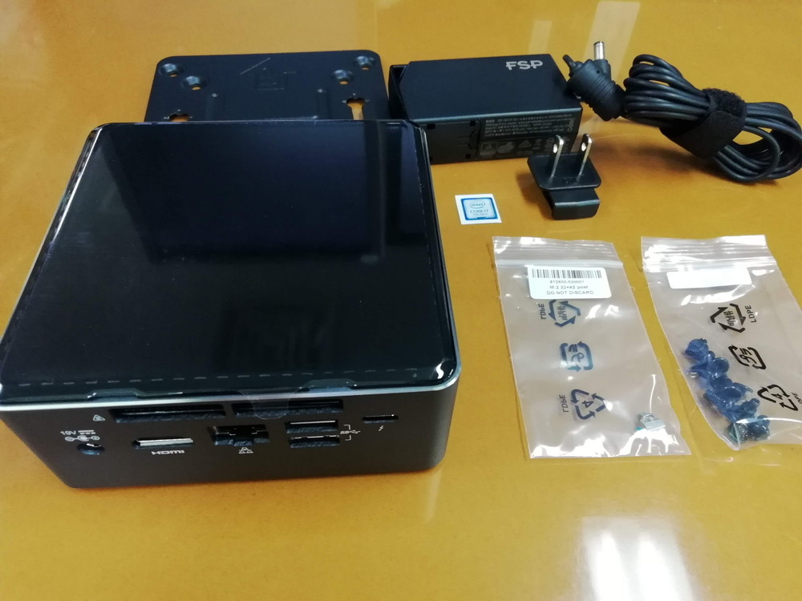

# 開発環境<br>on Ubuntu18<br>on NUC


## 目次

- NUCとは?
- NUCでやりたいこと
- 以前の私のDX
- 解決策＝環境を分割
- NVMeとは
- 開発マシン
- Ubuntu18のセットアップ
- ディスクのベンチマーク
- Ubuntu18のtips
- Ubuntu18で使用しているアプリ
- 困っていること
- まとめ


## NUCとは

- [Next Unit of Computing](https://www.ark-pc.co.jp/news/article?id=3001328)
- インテル製の小型ベアボーン
    - ベアボーン(キット): 半完成済みのPC(マザボ、ケース、電源)
    - NUCの場合、CPUはオンボードなのでメモリとディスクが必要
- ベアボーンの中でもかなり小型
- インターフェースが充実
    - Wifi, Bluetooth, USB3 x4, USB Type-C x1, HDMI, 有線LAN, SDメモリカードリーダー


## NUCでやりたいこと

- DX (Developer Experience) を向上させたい
    - 「気持ちよく開発・保守できるかどうか」
    - [DX: Developer Experience （開発体験）は重要だ - Islands in the byte stream](https://gfx.hatenablog.com/entry/2018/06/28/100103)


## 以前の私のDX

- Eclipse on Ubuntu16 on VirtualBox on Windows10
    - 下田さん製の Vagrantfile を vagrant up すれば、すぐに開発環境ができて楽
    - 仮想マシン上でのディスクの読み書きが遅い
    - ホストマシンのメモリ(16GB)を食う
        - Windows上でブラウザ開く
        - 仮想マシンそのものとEclipse


## 解決案＝環境を分割

- ドキュメント参照・編集環境
    - ブラウザ閲覧、エクセル編集などは既存のメインマシン(Windows)
    - ゆくゆくはノートPCで十分かも
- 開発環境
    - 技術サポート制度の範囲内で別マシンを用意
    - 最新・最善の環境
        - Core i7
        - DDR4 SDRAM 16GB以上
        - NVMe SSD 256GB以上
        - Ubuntu 18.04 LTS (2018-04 release)
    - 高スペックなノートPCだと10万円に収まらない <- NUC を選んだ理由の1つ 


## NVMeとは

- ディスクの接続インターフェース規格の一つ
    - non-volatile memory: 不揮発性メモリ
    - Express: PCI Expressという、ビデオカードによく使用される高速なインタフェース
- ディスクの接続規格
    - IDE (133 MB/s)
    - SATA (600 MB/s)
    - NVMe (4000 MB/s (Gen3 x4))


## 開発マシン


### 購入

- 2018-07頃
- [NUC7i7BNH](http://kakaku.com/item/K0000965242/) 54,980円
    - 2018-11-08 に最新型が発売 [NUC8i7BEH](https://akiba-pc.watch.impress.co.jp/docs/news/news/1152117.html) 67,700円
- [Transcend ノートPC用メモリ DDR4-2133 8GB SO-DIMM](http://kakaku.com/item/K0000831241/) 2枚 22,400円
    - 2016-10 5,000円
    - 2018-02 15,000円 (価格高騰がすごい)
    - 2018-10 10,000円
- [Intel SSD 760p M.2 PCIEx4 512GB](http://kakaku.com/item/K0001028199/) 19,480円
    - カタログ値 read 3,230 MB/s, write 1,625 MB/s
    - サムスンのNVMe SSDは爆熱らしい…
- 合計 96,860円


### 組み立て


- INTEL NUC


- メモリ


- NVMe SSD



- ディスプレイマウンタ、アダプタ、ネジ


- SATA接続の2.5 inch SSDも搭載可能


- 左にSSD、右にメモリの差込口が2つずつある


- メモリを差し込んで、


- メモリを下に押すと爪がはまる


- Visual BIOSでファームウェアアップデートする


- ファームウェアアップデートの様子。ここで電源落ちると起動できなくなる


## Ubuntu18のセットアップ
- NUCの最新のファームウェアをダウンロードしてUSBメモリに保存する
- NUCにUSBメモリを挿してBIOS設定起動
    - ファームウェアをインストール
    - 熱暴走を抑えるために**電源を省電力設定**にする
- Ubuntu18のisoをダウンロード
- isoをUSBメモリに焼く
- NUCにUSBメモリを挿して通常起動し、Ubuntuインストール
- **NVMe の設定を変更**
    - これやらないと突然フリーズする


### ラクーン固有の設定
- 管理チームに mac address を伝えてDHCP接続できるようにする
- fstの必要なディレクトリを(起動時に)マウントする
    - esetのインストーラ
    - プロジェクトフォルダ
- esetをインストール


### 補足
- Ubuntu16 は NVMe に未対応でインストールが進まず


## ディスクのベンチマーク
- [Windows Subsystem for Linuxとguest/native Ubuntuの性能をざっくりと比較 - Qiita](https://qiita.com/satoru_takeuchi/items/34e9568a9d9282bb37c2)
- ちなみに Windows機のディスクは TOSHIBA NVMe 512GB THNSN5512GPUK
    - カタログ値 read 1,500 MB/s, write 980 MB/s


### write

```
dd if=/dev/zero of=testfile bs=1M count=1024
dd if=/dev/zero of=testfile oflag=direct bs=1M count=1024
```

||WSL *1|guest Ubuntu *2|native Ubuntu|
|----|----|----|----|
|buffered MB/s|1,060|**131**|**2,780**|
|direct MB/s|1,240|error *3|1,480|

- *1 cd /mnt/c/Users/ohara.tomoki
- *2 cd /vagrant
- *3 invalid argument


### read

```
dd if=testfile of=/dev/zero bs=1M count=1024
echo 3 >/proc/sys/vm/drop_caches; dd if=testfile of=/dev/zero bs=1M count=1024
```

||WSL *1|guest Ubuntu *2|native Ubuntu|
|----|----|----|----|
|cached MB/s|2,600|**165**|**11,900**|
|no cache MB/s|-|131|2,700|

- *1 cd /mnt/c/Users/ohara.tomoki
- *2 cd /vagrant


### DX
- guest -> native
    - write: <span style="font-size: 2rem;">**x20**</span>
    - read: <span style="font-size: 2rem;">**x70**</span>


## Ubuntu18のtips
- super(Windowsキー or commandキー): 検索モード。アプリ名を入力して簡単起動。


- super + up: ウィンドウ最大化
- super + down: ウィンドウ元のサイズ
- super + left: ウィンドウ左半分
- super + right: ウィンドウ右半分


- Ctrl+Alt+Down: 下のワークスペースに移動
- Ctrl+Alt+Up: 上のワークスペースに移動


## Ubuntu18で使用しているアプリ

- Java IDE
    - Eclipse 2018-09
        - photon の次からこの形式。次は2018-12
- Editor
    - Visual Studio Code
    - Sublime Text3
- Browser
    - Firefox
    - Chrome (chrominumは使ってない)
- Communication
    - Slack


- Git GUI client
    - Sublime Merge
    - VSCode の GitLens Extension
    - SourceTree は Linux向けには無い
- SQL client
    - osqledit on wine
        - wine: Windows アプリを Linux で動かせるアプリ
    - MySQL Workbench
    - DBeaver Community が Oracle, MySQL対応で人気もあるようだが、Eclipse likeで使いにくかった
- xlsx
    - LibreOffice calc 閲覧するだけなら十分


## 困っていること
- /var/log/syslog に大量のログが書き込まれる(1日で200GB)
    - Ubuntu18のログイン画面で使用されているjsのエラーっぽい。Ubuntuの掲示板に報告が多数あるが、まだ直らない…
    - logrotateの設定を変えて回避しようとするも、うまく反映されない…
    - 2018-12以降、直ったっぽい
- 2018-12以降、Super + L で画面ロックできなくなった…
- Core i7 は発熱がすごい。Eclipseを操作するとファンがうなる。Core i5のモデルが使いやすいかも。


## 今後
- セットアップを簡単にする
    - セットアップスクリプトを作成？
        - shell script, Ansible, ...
    - Ubuntuをイメージ化して、それを新しいSSDにまるごとコピー？


- USB-Cで給電＆接続可能なポータブルディスプレイ(約3万円)を導入して、持ち運んで開発できるか試してみたい
    - LT大会の賞金はサポート制度、2位が3万円、1位が5万円上乗せ


## まとめ

- 技術サポート制度でより良い物理開発環境を構築した
- Intel NUCは良いぞ
- Ubuntu18は良いぞ
