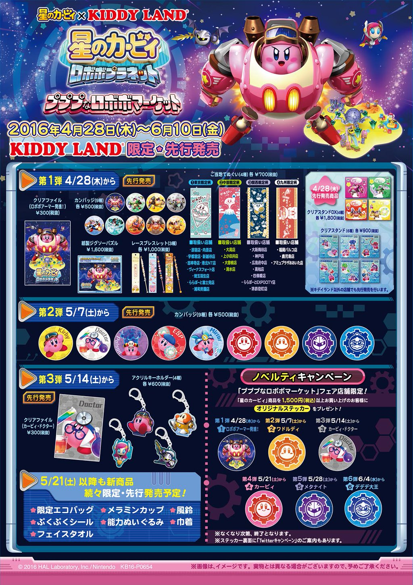

<!-- .slide: data-background="rgb(62,64,87)" class="center bg-black tl-l"  -->
# 最近、あのピンクの丸いヤツがヤバイ
<!--
 Twitter Emoji (Twemoji) Preview https://twemoji.maxcdn.com/2/test/preview.html
-->

<!-- .slide: class="center"  -->
# 突然ですが、

## みなさん、買ってクリアしましたよね？

<!-- .slide: class="center"  -->
# え？

<!-- .slide: class="center"  -->
😯

<!-- .slide: class="center"  -->
# 持ってない？

<!-- .slide: class="center"  -->
## そもそもカービィをよく知らない？

<!-- .slide: class="center"  -->
🤔

<!-- .slide: data-background="rgb(62,64,87)" class="center bg-black"  -->
## 5分くらいでわかる「カービィ」
## 最近のカービィ動向
## おすすめカービィグッズランキング

<!-- .slide: data-background="rgb(62,64,87)" class="center bg-black"  -->
# 5分くらいでわかる「カービィ」

<!-- .slide: class="center"  -->
## 基本情報

<!-- .slide: class="center"  -->
- 名前
    - カービィ(Kirby)
    - カービーやカーヴィーは間違い😡
    - 開発当初はポポポ(ゲームタイトルはティンクル・ポポ)
- 住んでいるところ
    - ポップスターという星のプププランド
- 身長
    - 20cm

<!-- .slide: class="center"  -->
- 好きなこと
    - 食べる
        - 好物はリンゴとトマト。苦手なものは毛虫。
    - 寝る
    - 歌う(音痴)
- 特技
    - 敵を吸い込んで能力をコピ－
    - ホバリング

<!-- .slide: class="center"  -->
## 作品

星のカービィ

(GB, 1992年4月27日)

<iframe src="https://www.youtube.com/embed/qFiB3f7vsFo" frameborder="0" allowfullscreen></iframe>

星のカービィ スーパーデラックス

(SFC, 1996年3月21日)

<iframe src="https://www.youtube.com/embed/n9ZhJxTQT6k" frameborder="0" allowfullscreen></iframe>

## テレビアニメ版星のカービィ

(TBS, 2001年10月6日 - 2003年9月27日)

> 社会風刺と共にメタフィクション要素が非常に多いのも特徴である。中にはアニメ制作を題材として現在のアニメ業界に対する批判を行う回もあり、第49話はアニメ制作現場の過酷さと作画崩壊を

<iframe src="https://www.youtube.com/embed/3JugwyP3RkI" frameborder="0" allowfullscreen></iframe>

<iframe src="https://www.youtube.com/embed/3y9kpsuhNr4" frameborder="0" allowfullscreen></iframe>
- 星のカービィ〜特別編〜倒せ!!甲殻魔獣エビゾウ 2009年8月9日、Wiiチャンネル『Wiiの間』
- 敵の小エビを吸ってコピーした能力とは？？

星のカービィ ロボボプラネット

(3DS, 2016年4月28日)

<iframe src="https://www.youtube.com/embed/nOUt0qE5on8" frameborder="0" allowfullscreen></iframe>

<!-- .slide: data-background="rgb(62,64,87)" class="center bg-black tl-l"  -->
# 最近のカービィ動向

<!-- .slide: class="center"  -->
<blockquote class="twitter-tweet" data-lang="ja">
はじめまして！『カービィカフェ』です。この夏、「星のカービィ」の世界観をテーマにしたカフェをオープンします。<a href="https://t.co/dGo0tFNSkl">https://t.co/dGo0tFNSkl</a> <a href="https://t.co/cV4cLaCtTJ">pic.twitter.com/cV4cLaCtTJ</a>
&mdash; KIRBY CAFÉ / カービィカフェ (@KirbyCafeJP) <a href="https://twitter.com/KirbyCafeJP/status/750886020275531776">2016年7月7日</a></blockquote>

<iframe src="https://kirbycafe.jp/" ></iframe>

<iframe src="https://www.bpnavi.jp/kuji/item/1654" ></iframe>

<!-- .slide: class="center"  -->
## ちなみに

<iframe src="https://www.superdelivery.com/p/do/psl/?word=%E3%82%AB%E3%83%BC%E3%83%93%E3%82%A3&so=score&vi=1&sb=all" ></iframe>

<!-- .slide: class="center"  -->
## SDがんばれ！！

<!-- .slide: data-background="rgb(62,64,87)" class="center bg-black tl-l"  -->
# おすすめカービィグッズランキング

<!-- .slide: class="center"  -->
# ７位

2017年スケジュール帳

￥1600

<!-- .slide: class="center"  -->
# ６位

星のカービィ ポリうちわ

￥330

<!-- .slide: class="center"  -->
# ５位

星のカービィ のせキャラ

￥2200

<!-- .slide: class="center"  -->
# ４位

星のカービィ トライタンロングタンブラー

￥950

<!-- .slide: class="center"  -->
# ３位

ねんどろいど カービィ

￥4500

<!-- .slide: class="center"  -->
# ２位

星のカービィ ぬいぐるみクッション（おすまし）

￥3800

<!-- .slide: class="center"  -->
# １位

星のカービィ まんまるスタンプ

￥240

<!-- .slide: data-background="img-open.jpg" class="center bg-image" -->
# まとめ

- カービィは義務教育である
- カービィファンの財布が2015年頃からヤバイ
- カービィスタンプはヤバイ
